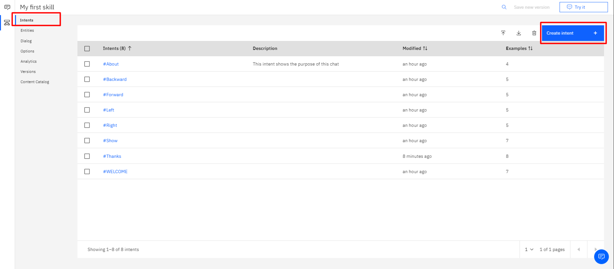
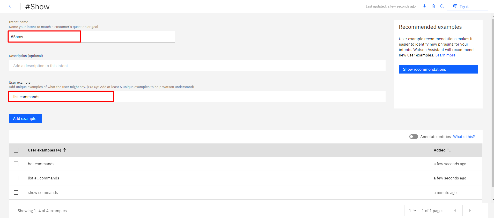
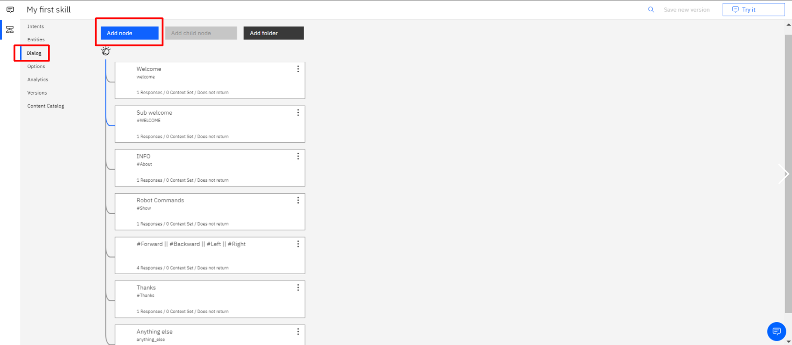
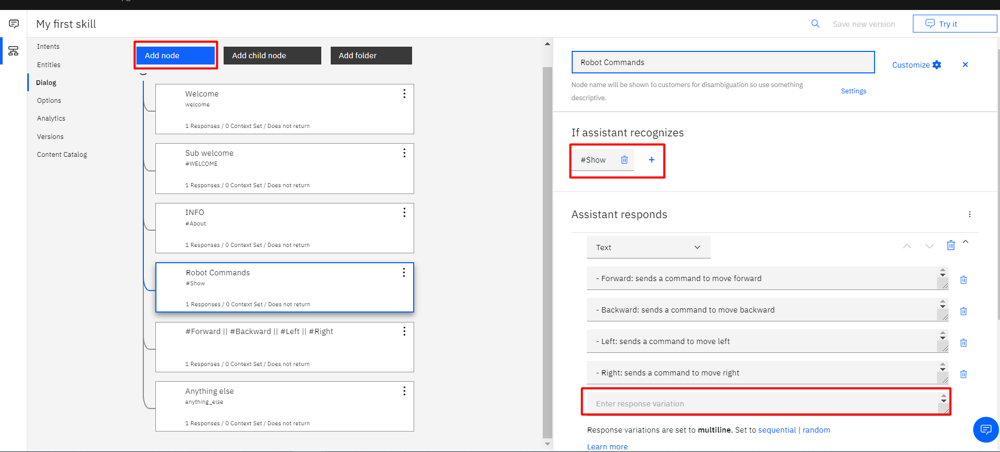
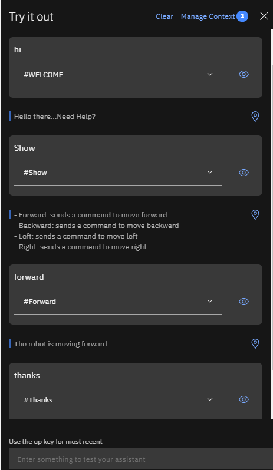
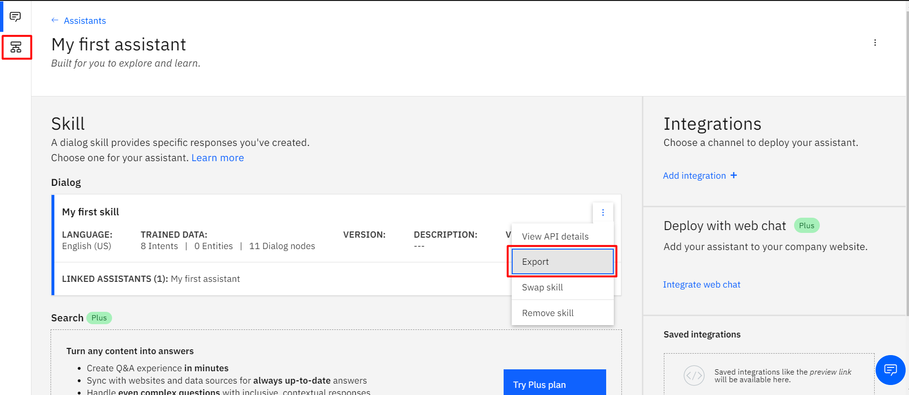

# A Simple IBM Watson ChatBot

## 1. Introduction

This is a simple IBM Watson ChatBot, that we will prepare to reply to some commands.

It is required to make an account, that can be done using this  [link](https://console.ng.bluemix.net/registration/?target=/catalog/services/conversation/)

But before we starts, here are some **basic concepts** used in the IBM Watson:

 - **Intent**
An intent is a collection of user statements that have the same meaning. By creating intents, you train your assistant to understand the variety of ways users express a goal.  [Learn more](https://eu-gb.assistant.watson.cloud.ibm.com/docs/?topic=assistant-intents)

 - **Entity**
Entities are like nouns or keywords. By building out your business terms in entities your assistant can provide targeted responses to queries. [Learn more](https://eu-gb.assistant.watson.cloud.ibm.com/docs?topic=assistant-entities)
 
 - **Dialog**
The dialog uses the intents that are identified in the user's input, plus context from the application, to interact with the user and ultimately provide a useful response.
The dialog matches intents (what users say) to responses (what the bot says back).[Learn more](https://cloud.ibm.com/docs/assistant?topic=assistant-dialog-build)

**Note**: the `.json` file of this example is added to the repository. You can import it and test it.

##  2. Preparing the ChatBot

### 2.1. Create an Intent

First we need to set some keywords, that Watson can recognize.

1.  Go to Intents tab
2.  Click on 'Create intent'

 
 
###  2.2. Set the Intent

First we need to specifiy the Intent name. This could be a category name. In the example below I wrote 'Show' which will be used for showing the commands to user.

Then, we will set some user examples. In our example I added **seven** examples :

-  show commands
-  show robot commands
- show all
- list commands
- bot commands
- help
- list all commands 

The more examples we add the better watson will be able to understand user queries.

### 2.3. Repeate Previous Steps

Repeate the previous steps until you added all your commands. In our example we had **8 Intents** as shown in the image at 2.1 section.

### 2.4. Prepare the Dialog

In this part we will prepare the replies watson can provide to the user.

1.  Go to Dialog tab
2.  Click 'Add node'

**Note**: There will be **two** nodes added by defualt which are Welcome and Anything else. Those are used to welcome the user, and to say some specific reply when watson doesn't understand.

  
### 2.5. Customize the Node

Here we will configure the replies that watson can say.

The most important fields are 'If assistant recognizes' and 'Assistant responds'

In 'If assistant recognizes' field we will specify the intent that is suited for the responds we will add. In this case I selected '#Show' as I am intrested in printing the robot commands.

**Note**: You can add multiple intents by clicking on the '+' sign, then specify the relation (AND or OR).

In 'Assistant responds', First I made sure that I chose mutliline to add multiple lines. Then I added the commands I had.

### 2.6. Repeate Last Two Steps

Repeate 2.4-2.5 steps, until you added all the intents and the responds you wanted.

### 2.7. Try the ChatBot

On the top right click on 'Try it'

Then write some command. In the example below we intaracted with the bot and it responded accordingly (e.g. 'Show commands' and Watson replied with the commands).

And for the `.json` file you can **export** it  by clicking on the **Skills** icon "upper left" then clicking on the ***three dots*** icon then export , showed in the following figure. It will give you a `.json` file. 

